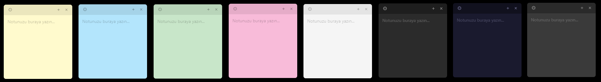

# WinPost-it

Windows masaüstü için hafif, çok pencereli yapışkan not uygulaması.

> 

## Özellikler

- Masaüstünde istediğin yere yerleştirilebilen notlar
- 8 farklı tema: Sarı, Mavi, Yeşil, Pembe, Beyaz, Koyu, Gece, Antrasit
- Notlar otomatik kaydedilir (`Documents/post-it/notes.json`)
- Sistem başlangıcında otomatik açılır
- Sistem tepsisi ikonu — açık notları görüntüle, yeni not oluştur, tümünü kapat
- `.postit` dosya formatıyla not dışa aktarma ve açma desteği
- Görsel ekleme: ```🖼``` butonuyla dosyadan veya Ctrl+V ile panodan görsel ekle; metin içinde istediğin konuma yerleştir, köşe handle'larıyla yeniden boyutlandır

## Kurulum

```bash
npm install
npm start
```

## Build (Windows Setup)

```bash
npm run build
```

Çıktı: `dist\Post-it Setup 1.0.0.exe`

Setup kurulumda masaüstüne kısayol oluşturur ve kurulum klasörü seçimine izin verir.

## Proje Yapısı

```
main.js              # Ana süreç: pencere yönetimi, pencere havuzu, IPC, dosya I/O, tray
preload.js           # contextBridge — renderer'a güvenli IPC API'si sunar (görsel seçimi dahil)
preload-dialog.js    # Dialog penceresi için contextBridge
src/
  note.html          # Her post-it penceresi (contenteditable editör + görsel overlay)
  note.css           # Post-it stilleri (temalar, editör, görsel boyutlandırma UI)
  note.js            # Renderer: yazma, görsel ekleme/yapıştırma/boyutlandırma, tema seçimi
  dialog.html        # Kapatma onay dialog'u
assets/
  icon.ico           # Uygulama ikonu (setup ve .exe)
```

## Veri Depolama

Notlar `%USERPROFILE%\Documents\post-it\notes.json` dosyasında saklanır.

```json
{
  "id": "uuid",
  "text": "Not içeriği (HTML — görseller base64 olarak gömülüdür)",
  "theme": "yellow",
  "color": "#FFFACD",
  "x": 120,
  "y": 300,
  "width": 220,
  "height": 240
}
```

`.postit` dosyaları `%USERPROFILE%\Documents\post-it\` klasörüne kaydedilir. Daha önce kaydedilmiş bir `.postit` güncellendiğinde yeni dosya oluşturulmaz, mevcut dosya güncellenir.

## Kullanım

| İşlem | Nasıl |
|---|---|
| Yeni not | Toolbar'daki `+` butonu veya tray menüsü |
| Notu kapat | Toolbar'daki `×` butonu |
| Tema değiştir | Toolbar'daki `⚙` butonu → tema seç |
| Notu taşı | Toolbar'dan sürükle |
| Tüm notları kapat | Tray → Tüm Notları Kapat |
| Uygulamadan çık | Tray → Çıkış |
| Görsel ekle (dosyadan) | Toolbar'daki `🖼` butonu |
| Görsel ekle (panodan) | Editöre tıkla → `Ctrl+V` |
| Görseli yeniden boyutlandır | Görsele tıkla → köşe handle'larını sürükle |
| Görseli sil | Görsele tıkla → `Delete` veya `Backspace` |
